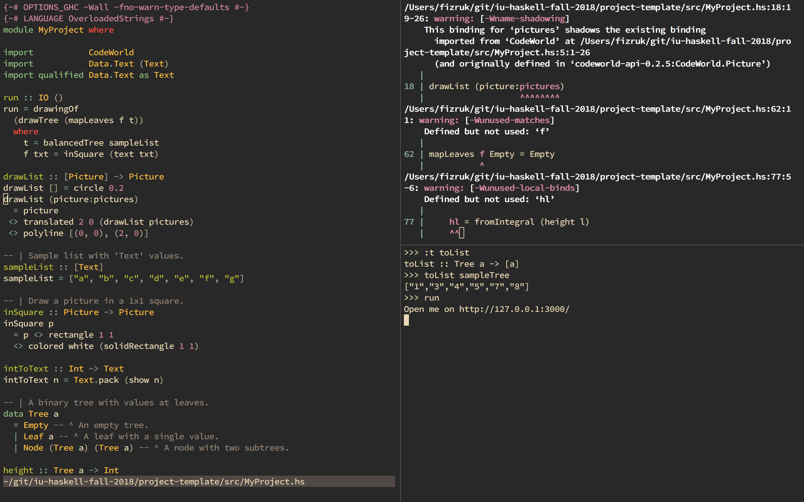

## The game at runtime can have one of the states:
* Menu
* The game itself
* Animation of water in pipes
* Won or lost message

## Menu
  contains 3 levels that are generated from 3 predefined levels
  
## The game
  The player should:
    * Rotate all the pipes in such a way that all of them are connected and lead to the bath.
    * To rotate the pipe, click on it
    * When you want to check results, click on water tap
## Animation of water pass
  During the animation water will pass from water tap to pipes
  Animation will show the places of leackages
  
## Win or lost messages
  Tell you the result of the game

