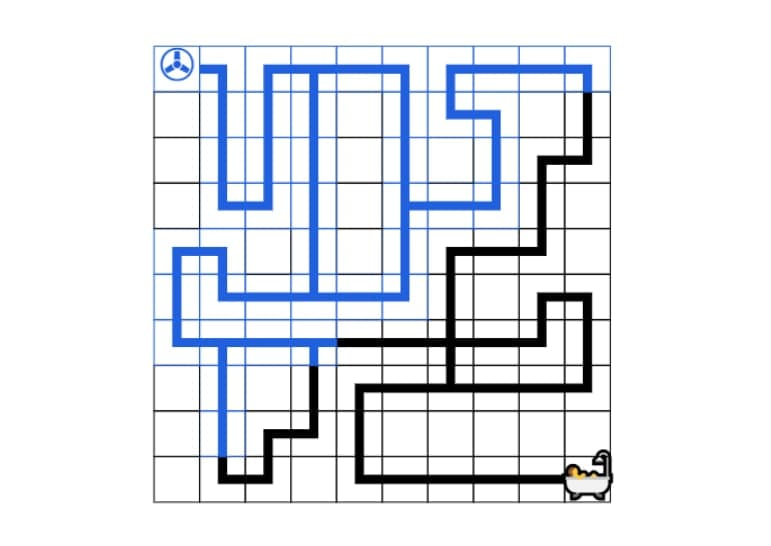

## The game at runtime can have one of the states:
* Menu
* The game itself
* Animation of water in pipes
* Won or lost messages

## Menu
  Menu contains 3 levels for you to choose.
  
  
  
## The game
  The player should:
    
    - Rotate all the pipes in such a way that all of them are connected and lead to the bath.
    
    - To rotate the pipe, click on it
    
    - When you want to check results, click on water tap
  

## Animation of water pass
  During the animation water will pass from water tap to pipes
  
  
  Animation will show the places of leakages if any
  
  
  
## Win or lost messages
  Tells you the result of your try
  
  In case you won:
  
  
  In case you lost:
  
